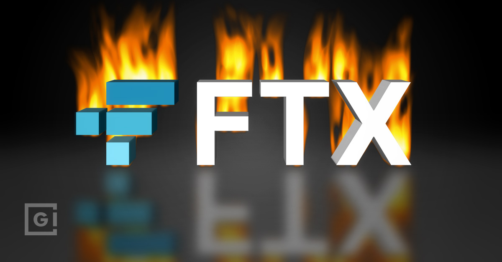
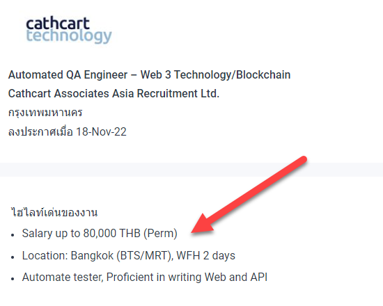

# Blockchain for Industrial Engineers: Decentralized Application Development

## บล็อกเชนสำหรับวิศวกรอุตสาหการ: การพัฒนาแอปพลิเคชันแบบกระจายศูนย์

---

# General Details

- **รหัสกระบวนวิชา**: วศ.อ. 499 (255499)
- **ภาคการศึกษา**: 2565-2
- **ชื่อกระบวนวิชา**:
  - หัวข้อพิเศษสำหรับสาขาวิชาวิศวกรรมอุตสาหการ 2
  - Special Topics in Industrial Engineering 2
- **อาจารย์**: ผศ.ดร.นิรันดร์ พิสุทธอานนท์

---

# After this class you will be able to

- มีความเข้าใจพื้นฐานในเทคโนโลยีบล็อกเชน
- สามารถสร้างแอปพลิเคชันบนบล็อกเชน
- มีความเข้าใจพื้นฐานในเทคโนโลยีของเวป
- สามารถสร้างแอปพลิเคชันแบบกระจายศูนย์โดยใช้เทคโนโลยีบล็อกเชนและเทคโนโลยีของเวป

---

# Why

เทคโนโลยี Blockchain ถือว่าเป็นเทคโนโลยีที่ทำให้เกิดการปฏิวัติตัวกลางครั้งใหญ่ที่สุดในประวัติศาสตร์เลยก็ว่าได้ โดยคนส่วนมากจะคิดว่า Blockchain นั้นมีไว้สร้างสกุลเงินเพียงอย่างเดียว (เช่น Bitcoin และ Ethereum) แต่จริง ๆ แล้วสกุลเงินนั้นเป็นเพียงหนึ่งใน Application ของ Blockchain เท่านั้น เทคโนโลยี Blockchain สามารถนำมาประยุกต์ใช้กับ อุตสาหกรรมต่างๆได้มากมาย ไม่ว่าจะเป็น ด้านอาหาร พลังงาน ยานยนต์ การแพทย์ หรือบันเทิง ซึ่งเทคโนโลยี Blockchain นี้ยังอยู่ในช่วงเริ่มต้นของการนำไปประยุกต์ใช้ และมีศักยภาพที่จะกลายเป็นเทคโนโลยีกระแสหลักในอนาคตได้ ดังนั้นการมีความเข้าใจและคุ้นเคยกับเทคโนโลยี Blockchain จะทำให้นักศึกษามีความพร้อมในการปรับตัวเข้าสู่โลกยุคดิจิทัล และเปิดโอกาสการทำงานให้กว้างขึ้น

---

# Actually, this is why

- [Technicals hint Bitcoin bull market could kick off in April 2023
  ](https://finbold.com/technicals-hint-bitcoin-bull-market-could-kick-off-in-april-2023/)

---

# Reality

---

# Blockchain in engineering applications?

---

#

---

# Job market

---

# แผนการประเมินการเรียนรู้

| วิธีการประเมินผลการเรียนรู้ | สัดส่วนของการประเมิน |
| :-------------------------: | :------------------: |
|        การสอบกลางภาค        |         20%          |
|        การสอบปลายภาค        |         20%          |
|  การประเมินเวปแอปพลิเคชัน   |         30%          |
|  การประเมินเวปแอปพลิเคชัน   |         30%          |

---

# แผนการสอน

- Midterm
  - HTML, CSS, JavaScript
  - "Todo App"
- Final
  - React JS, Google Firebase
  - Project

---

# Software

- Applications that runs on top of an operating system
  - Windows, MacOS, Linux, Android, iOS
- "Talk" to OSs directly.
- Cannot be used between operation systems.
- Use different technologies/languages
  - C# (Windows), Swift (MacOS, iOS), Kotlin (Android), C++ (Linux)

---

# Web Application

- Applications that execute on a browser (another application) that runs on top of an operating system.
- Does not "talk" to the system directly.
- _Cross platform_
  - "Write once, use anywhere"
- Use similar technogoies/languages
  - HTML, CSS, JavaScript

---

# Types of "Web" Developers

- Front End
- Back End
- Dev Ops
- Full Stack

---

# Web Developer Roadmap

[Do not panic!](https://github.com/kamranahmedse/developer-roadmap)

---

# Lets get started

---

# Tools

- Web browser
  - Chrome
- Integrated development environment (IDE)
  - VS Code
- _Let's go_
