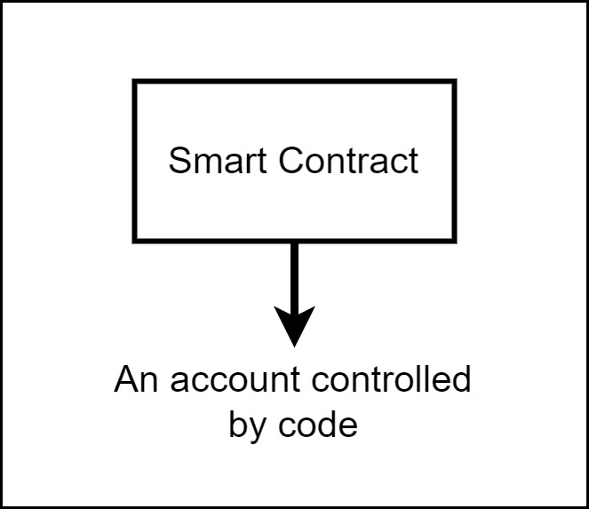
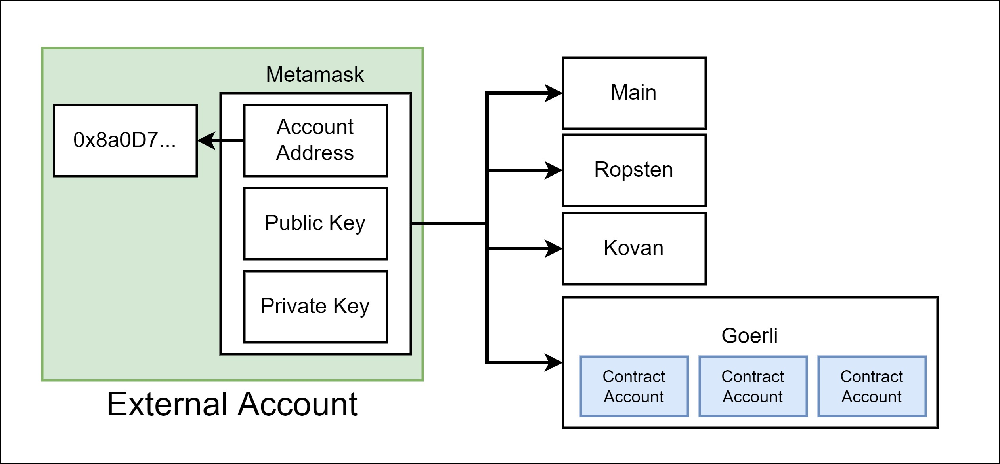
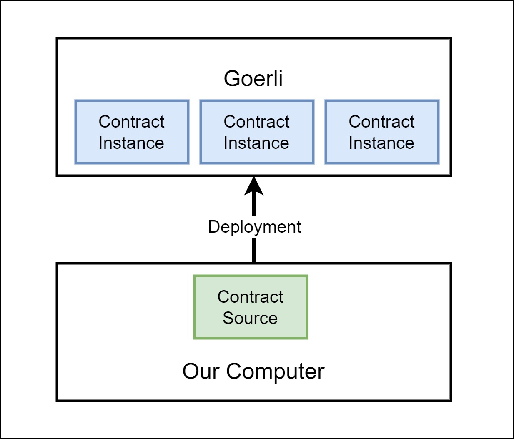
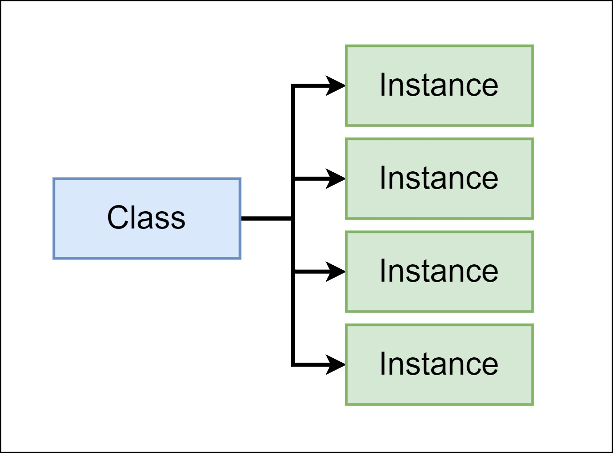
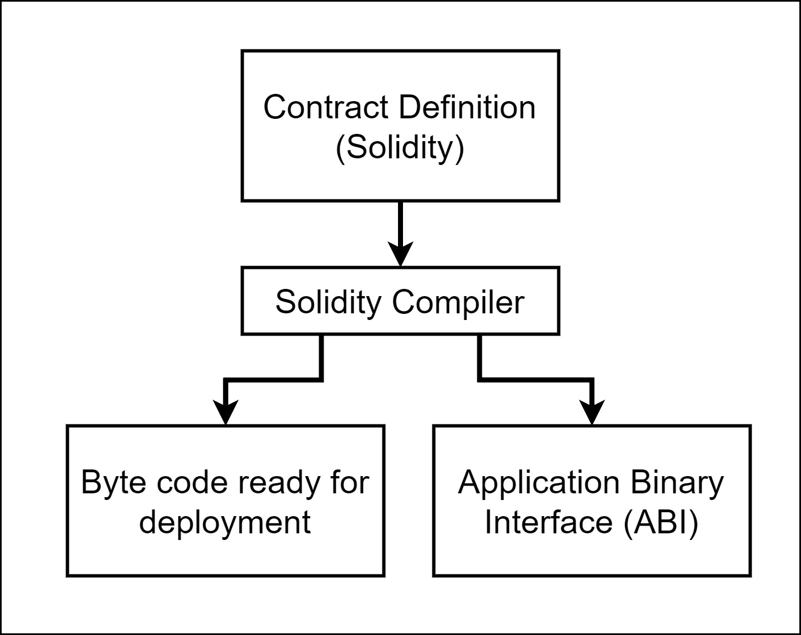
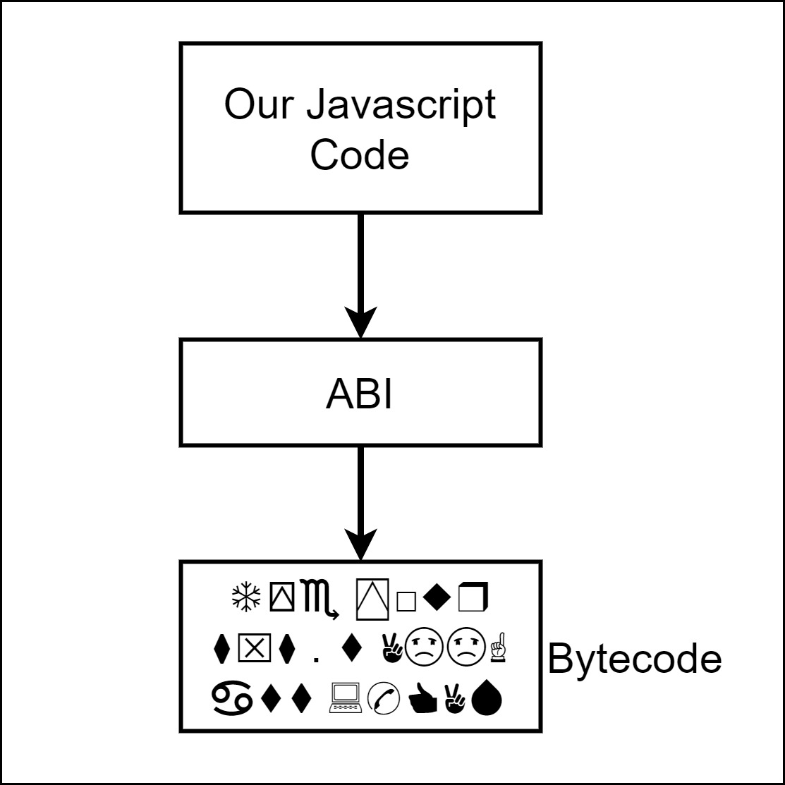

# Blockchain for Industrial Engineers: Decentralized Application Development

## บล็อกเชนสำหรับวิศวกรอุตสาหการ: การพัฒนาแอปพลิเคชันแบบกระจายศูนย์

---

# Smart contract

- A smart contact is an account controlled by code.
- The code instructs the account how to behave.
  

---

| Field   | Description                                        |
| ------- | -------------------------------------------------- |
| Balance | Amount of ether this accoun owns. (Similar to EOA) |
| Storage | Data storage for this contract                     |
| Code    | Raw machine code for this contract                 |

---

# Contract account deployment

- A particular EOA is valid in all networks.
- CA needs is locally available in the deployed network.

---

# Contract account deployment

- We write source code.
- We deploy contract to a network.
  - Create an _instance_ of a contract (or **contract account**)
- There can be multiple instance of a contract.

---

# Class

---

# Solidity programming language

- Language that we will use to write the source code of a smart contract.
- Written in `.sol` files
- Strongly typed

---

# Workflow

---

# ABI

