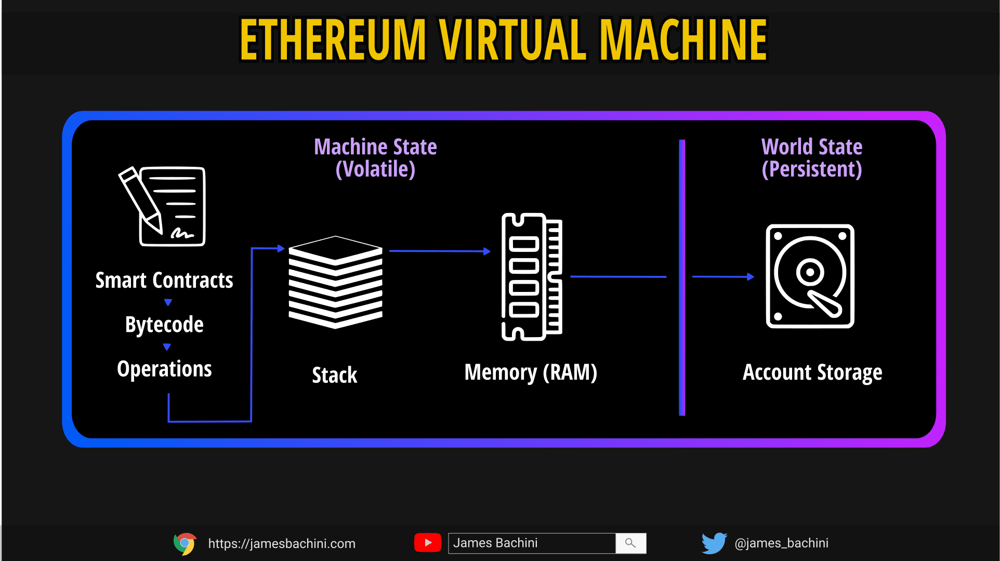

<style>
@import url('https://fonts.googleapis.com/css2?family=Prompt:ital,wght@0,100;0,300;0,400;0,700;1,100;1,300;1,400;1,700&display=swap');

    :root {
    font-family: Prompt;
    --hl-color: #D57E7E;
}
h1 {
  font-family: Prompt
}
</style>

# Blockchain for Industrial Engineers: Decentralized Application Development

## บล็อกเชนสำหรับวิศวกรอุตสาหการ: การพัฒนาแอปพลิเคชันแบบกระจายศูนย์

---

```js
// SPDX-License-Identifier: GPL-3.0

pragma solidity >=0.7.0 <0.9.0;

/**
 * @title Storage
 * @dev Store & retrieve value in a variable
 * @custom:dev-run-script ./scripts/deploy_with_ethers.ts
 */
contract Storage {

    uint256 number;

    /**
     * @dev Store value in variable
     * @param num value to store
     */
    function store(uint256 num) public {
        number = num;
    }

    /**
     * @dev Return value
     * @return value of 'number'
     */
    function retrieve() public view returns (uint256){
        return number;
    }
}
```

---

# SPDX License Identifier

```js
// SPDX-License-Identifier: GPL-3.0
```

- Specify that the source code is available.
- Every source file should start with a comment indicating its license.

---

# Pragma

```js
pragma solidity >=0.7.0 <0.9.0;
```

- Specify the version of compiler to use.
- Help reject compilation with future compiler versions that might introduce incompatible changes.

---

# Comment

```js
// This is a single-line comment.

/*
This is a
multi-line comment.
*/
```

---

# Basic syntax

- Case sensitive
- Every statement must end with a semicolon `;`.
- Use curly braces `{}` for a block of code.
- Most of the structures are available
  - `if`, `else`, `while`, `for`, `break`, `return`

---

# Variable

- State variables
- Local variables

---

# State variables

- Declared at the contract level.
- Permanently stored in contract storage.
- Can be set as `constant`.
- Expensive to use
  - _Costs gas_
- To set value of a state variable
  - Initailize value at declaration.

---

# Local variables

- Declared inside functions.
- Free (no gas cost).
- Use `memory` keyword for `string`.

---

# Where is the data stored?

---

# 1. Storage

- Holds state variables.
- Persistent and expensive
  - It costs gas.
- Like a computer HDD.

---

# 2. Stack

- Holds local variables defined inside functions
  - If they are not reference types
  - `int`, `uint`, for example
- Free to be used
  - It doesn't cost gas.

---

# 3. Memory

- Holds local variables defined inside functions
  - If they are reference types.
  - `string`, `array`, `struct` and `mapping`
  - Use `memory` keyword.
- Holds function arguments;
- Like a computer RAM;
- Free to be used
  - It doesn’t cost gas.

---



[Source](https://jamesbachini.com/assembly-in-solidity/)
