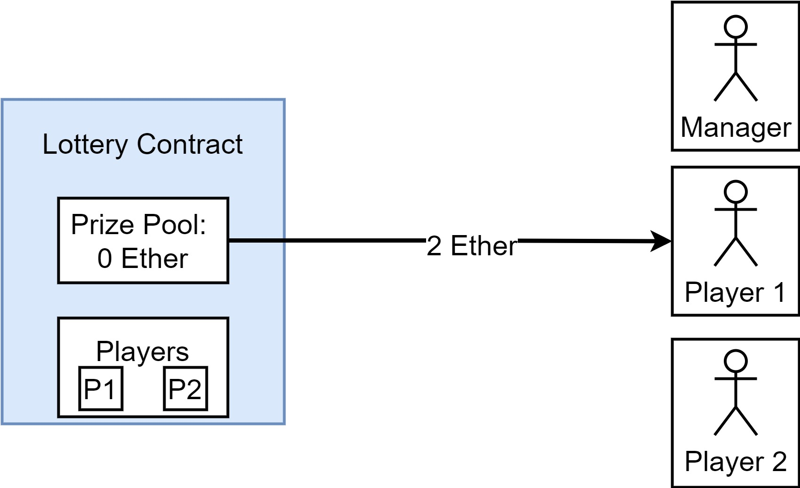

# Blockchain for Industrial Engineers: Decentralized Application Development

## บล็อกเชนสำหรับวิศวกรอุตสาหการ: การพัฒนาแอปพลิเคชันแบบกระจายศูนย์

---

# Lottery

---

# Setup

---

# Entering a lottery

---

# Picking a winner

Note: manager does not _choose_ the winner, but only tell the contract to choose the winner.

---

# Sending back the prize

---

# Varaibles

| Name      | Purpose                                           |
| --------- | ------------------------------------------------- |
| `manager` | **Address** of person who created the contract    |
| `players` | **Array** of addresses of people who have entered |

---

# Functions

| Name         | Purpose                                                      |
| ------------ | ------------------------------------------------------------ |
| `enter`      | Enters a player into the lottery                             |
| `pickWinner` | Randomly picks a winner and sends them the prize poolentered |

---

# Variables - `address`

---

# `msg` object

---

---

# Storing `players`

- Array

---

# Reference type varaibles

