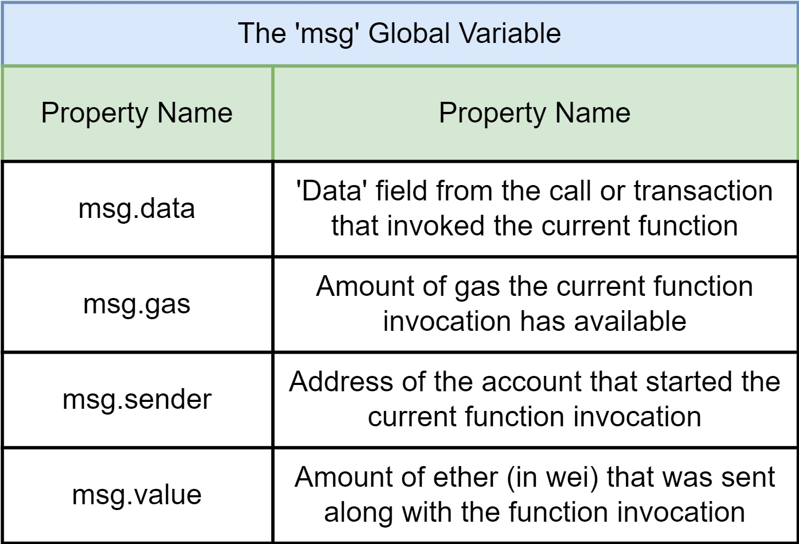
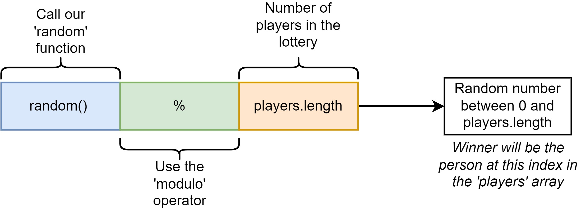
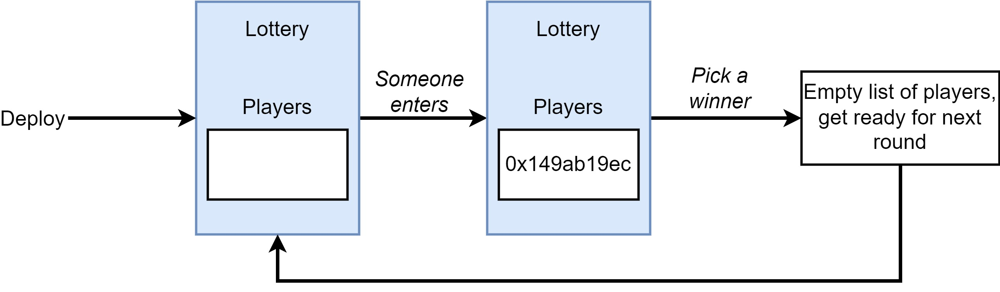

<style>
@import url('https://fonts.googleapis.com/css2?family=Prompt:ital,wght@0,100;0,300;0,400;0,700;1,100;1,300;1,400;1,700&display=swap');

    :root {
    font-family: Prompt;
    --hl-color: #D57E7E;
}
h1 {
  font-family: Prompt
}
</style>

# Blockchain for Industrial Engineers: Decentralized Application Development

## บล็อกเชนสำหรับวิศวกรอุตสาหการ: การพัฒนาแอปพลิเคชันแบบกระจายศูนย์

---

# Lottery - last time

```js
// SPDX-License-Identifier: GPL-3.0

pragma solidity >=0.7.0 <0.9.0;


contract lottery {
    address public manager;

    constructor () {
        manager = msg.sender;
    }
}
```

---

# Add players arrays

```js
address[] public players;
```

---

# Add `enter` function

```js
function enter() public payable {
    players.push(msg.sender);
}
```

---

# Function type

###

| Type        | Description                                                         |
| ----------- | ------------------------------------------------------------------- |
| view        | This function returns data and does not modify the contract's data. |
| pure        | This function does not read or modify the contract's data.          |
| **payable** | When someone call this function, they might send ether along.       |

---

# `msg.value`



---

# Add a check for minimum amount

```js
require(msg.value > 0.1 ether, "Please send at least 0.1 ETH.");
```

---

# `require` function

- Used to verify inputs and conditions before execution.
- If the condition is false, then the require function immediately stops execution.

```js
require(sum == 10, "Incorrect");
```

---

# Unit converter

- 1 ether (ETH) = 1e18 wei
  - 1 ETH = 1,000,000,000,000,000,000 wei
- [Link](https://eth-converter.com/)

---

# Add `getPlayers` function

```js
function getPlayers() public view returns(address[] memory) {
    return players;
}
```

---

# Add a function to generate random number

```js
function random() private view returns (uint256) {
  ...
}
```

---

# Random number

- Solidity code should be deterministic
  - It will run on multiple nodes.
- We need an algorithm that is able to generate a random number once, and use it on multiple nodes.

---

# Psudeo-random number generation

- Use `block.timestamp` and `block.difficulty`
- ➡️ `abi.encodedPacked()`
  - Argument-encoding function
  - Output: `bytes` (dynamic array of `byte`)
- ➡️ `keccak256()`
  - Hash function
  - Output: `bytes32` (array of exactly 32 bytes long)
- ➡️ `uint256()`
  - Output: `uint256`

---

# Add `pickWinner` function

```js
function pickWinner() public {
    uint256 idx = random() % players.length;
    uint256 balance = address(this).balance;
    payable(players[idx]).transfer(balance);
}
```

---

# Select a winner



---

# `this` keyword

- Pointer to the current contract.
- Convertible to `address`.
  - `address(this)`

---

# `address` vs `address payable` types

- The `address` and `address payable` are different types.
- You can use `.transfer(..)` on `address payable`, but not on `address`.
- To change from `address` to `address payable`,
  - Use `payable(...)` function

---

# Reset

```js
players = new address[](0);
```

---

# Reset



---

# Validation

```js
require(msg.sender == manager, "You need to be a manager.");
require(players.length > 0, "Need at least one player.");
```

---

# Let's play a lottery.
