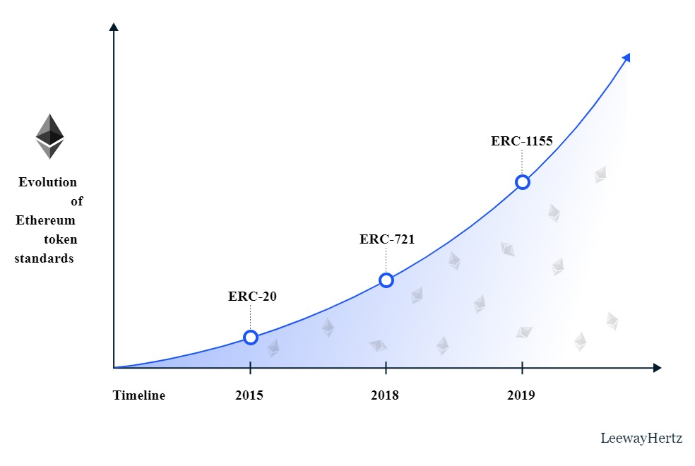

<style>
@import url('https://fonts.googleapis.com/css2?family=Prompt:ital,wght@0,100;0,300;0,400;0,700;1,100;1,300;1,400;1,700&display=swap');

    :root {
    font-family: Prompt;
    --hl-color: #D57E7E;
}
h1 {
  font-family: Prompt
}
</style>

# Blockchain for Industrial Engineers: Decentralized Application Development

## บล็อกเชนสำหรับวิศวกรอุตสาหการ: การพัฒนาแอปพลิเคชันแบบกระจายศูนย์

---

# ERC Token

---

# What is a token?

- Something of value
  - Currency
  - Voting right
  - Stock
- Token standard
  - EIP (_Ethereum Improvement Proposal_)
    - Guideline
  - ERC (_Ethereum Request for Comments_)
    - Implementation

---

# Popular token standards

- **ERC-20**
  - Fungible tokens
  - Most used for representing currency
- **ERC-721**
  - Non-fungible tokens (NFTs)
  - Most used for representing digital artwork and collectibles
- **ERC-1155**
  - Multi-token standard
  - Combining the abilities of ERC-20 and ERC-720

---

# Timeline


[Source](https://www.leewayhertz.com/erc-20-vs-erc-721-vs-erc-1155/)

---

# Token list

- https://etherscan.io/tokens

---

# Let's make your own ERC-20 token.

---

# You need to know

- Inheritance
- Abstract
- Interface
- Event

---

# Inheritance

- A contract can inherit from another contract (base contract).
  - State variables
  - Functions
- Use a keyword `is`.

---

# Abstract contract

- Abstract contract cannot be deployed.
  - Can only be used as a base contract.
  - Used as a "designed" contract.
- Abstract contract can contain `virtual` functions.
  - A `virtual` function does not contain implementation.
  - Need a keyword `virtual`.
- When implementing a `virtual` function
  - Need to use `override` keyword.

---

# Interface

- Cannot be deployed.
- Cannot have a constuctor.
- Cannot declare a state varible.
- Cannot have function implementation.
- All declared functions must be `external`
  - `external` makes a function callable from outside contract only.
  - _Note: `public` can be called from both externally and internally._
- The function implementation can be declared `public`.

---

# Events

- An inheritable member of a contract
- Stores the arguments passed in the transaction logs when `emitted`.
- Used to inform the calling application about the current state of the contract.
  - MetaMask use `event` to inform user of the progress of the deployment.

---

# ERC-20 Token Interface

- [Standard](https://ethereum.org/en/developers/docs/standards/tokens/erc-20/)

---

```js
interface ERC20Interface {
    // State variables
    function name() external view returns (string memory);
    function symbol() external view returns (string memory);
    function decimals() external view returns (uint8);
    function totalSupply() external view returns (uint256);

    // Mandatory functions
    function balanceOf(address _owner) external view returns (uint256 balance);
    function transfer(address _to, uint256 _value) external returns (bool success);

    // Optional functions
    function allowance(address _owner, address _spender) external view returns (uint256 remaining);
    function approve(address _spender, uint256 _value) external returns (bool success);
    function transferFrom(address _from, address _to, uint256 _value) external returns (bool success);

    // Events
    event Transfer(address indexed _from, address indexed _to, uint256 _value);
    event Approval(address indexed _owner, address indexed _spender, uint256 _value);

}
```

---

# Decimals

- How many decimal places a token (say, `GLD`) has.
- If `decimal = 1`, internally, 10 `unit` is equal to 1 `GLD`.
- If you want to transfer 1.5 `GLD`, internally you will actually transfer 15 `unit`.
- Decimals is only used for display purposes.
  - All arithmetic inside the contract is still performed on integers,
