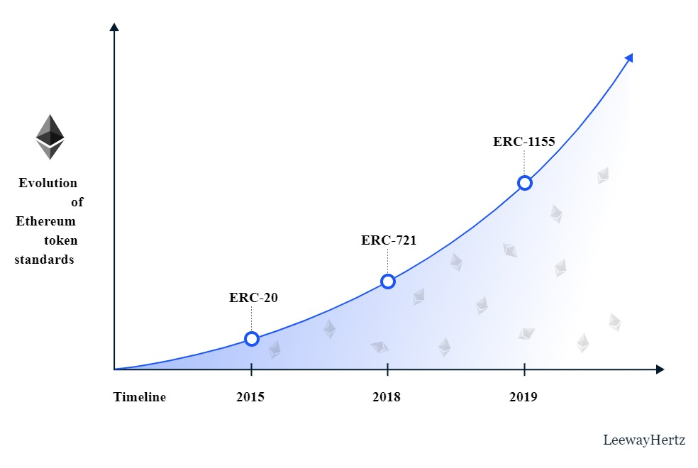

# Blockchain for Industrial Engineers: Decentralized Application Development

## บล็อกเชนสำหรับวิศวกรอุตสาหการ: การพัฒนาแอปพลิเคชันแบบกระจายศูนย์

---

# ERC Token

---

# What is a token?

- Something of value
  - Currency
  - Voting right
  - Stock
- Token standard
  - EIP (_Ethereum Improvement Proposal_)
    - Guideline
  - ERC (_Ethereum Request for Comments_)
    - Implementation

---

# Popular token standards

- **ERC-20**
  - Fungible tokens
  - Most used for representing currency
- **ERC-721**
  - Non-fungible tokens (NFTs)
  - Most used for representing digital artwork and collectibles
- **ERC-1155**
  - Multi-token standard
  - Combining the abilities of ERC-20 and ERC-720

---

# Timeline

[Source](https://www.leewayhertz.com/erc-20-vs-erc-721-vs-erc-1155/)

---

# Token list

- https://etherscan.io/tokens

---

# Let's make your own ERC-20 token.

---

# You need to know

- Inheritance
- Abstract
- Interface
- Event
