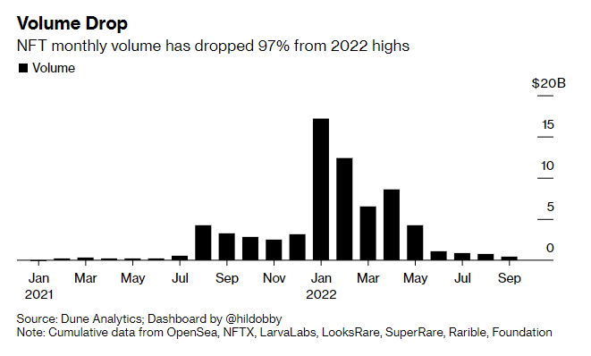
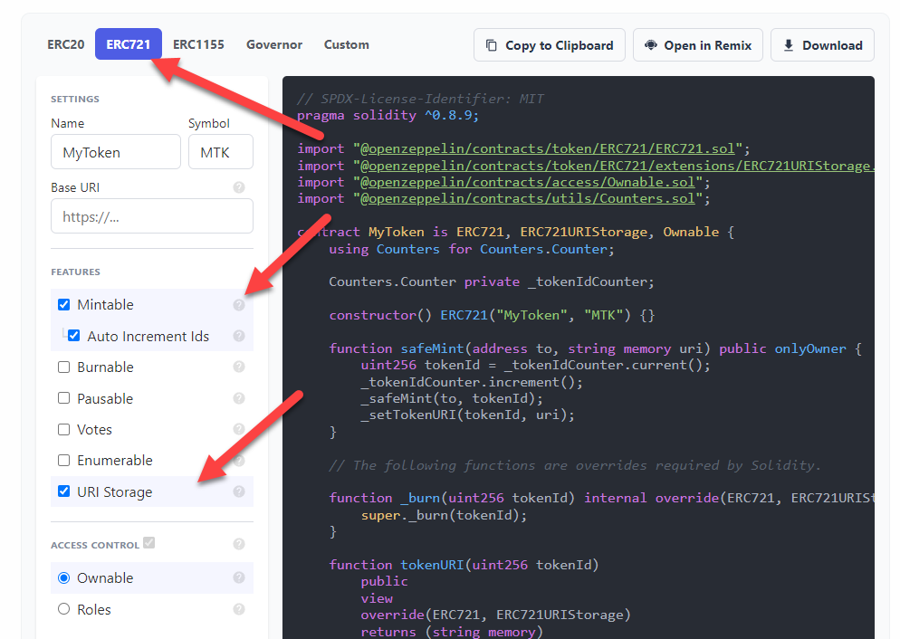

<style>
@import url('https://fonts.googleapis.com/css2?family=Prompt:ital,wght@0,100;0,300;0,400;0,700;1,100;1,300;1,400;1,700&display=swap');

    :root {
    font-family: Prompt;
    --hl-color: #D57E7E;
}
h1 {
  font-family: Prompt
}
</style>

# Blockchain for Industrial Engineers: Decentralized Application Development

## บล็อกเชนสำหรับวิศวกรอุตสาหการ: การพัฒนาแอปพลิเคชันแบบกระจายศูนย์

---

# Non-Fungible Token (NFT)

---

# Non-Fungible Token (NFT)?

- Cryptographic assets on a blockchain with unique identification codes and metadata that distinguish them from each other.
- Cannot be traded or exchanged at equivalency.
- NFTs can represent real-world items like artwork and real estate.

---

# Hype?



---

# Standard

- ERC-721 standard
  - Most common
- The ERC-1155 standard takes the concept further.
  - Reducing the transaction and storage costs required for NFTs.
  - Natching multiple types of non-fungible tokens into a single contract.

---

# NFTs in action

- [Mutant Hounds #1775](https://opensea.io/assets/ethereum/0x354634c4621cdfb7a25e6486cca1e019777d841b/1775)

  - [Contract](https://etherscan.io/address/0x354634c4621cdfb7a25e6486cca1e019777d841b)

  - [Token URI](https://api.mutantdao.com/hounds/metadata/1775)

  - [Image](https://ipfs.io/ipfs/bafybeicozx2qj43d22h2nmamhp56ejhtudijoldn5ofmlg2mmikdia42na)

---

# Create your own NFTs (simple)

[OpenSea Testnet](https://testnets.opensea.io/)

---

# Implementing ERC721

- [OpenZeppelin](https://docs.openzeppelin.com/contracts/4.x/wizard)



---

# Source codes

- [ERC721 ](https://github.com/OpenZeppelin/openzeppelin-contracts/blob/master/contracts/token/ERC721/ERC721.sol)

- [ERC721 Interface](https://github.com/OpenZeppelin/openzeppelin-contracts/blob/master/contracts/token/ERC721/IERC721.sol)
  - [EIP-721](https://eips.ethereum.org/EIPS/eip-721)
- [Ownable.sol](https://github.com/OpenZeppelin/openzeppelin-contracts/blob/master/contracts/access/Ownable.sol)
  - `owner` variable, for example.

---

# Function overloading

In some programming languages, function overloading or method overloading is the ability to create multiple functions of the same name with different implementations.

---

# Create your own NFTs (real)

1. **Create image**
2. **Upload to IPFS**
   2.1 Get `image_url`
3. **Create metadata**
   3.1 Save as `JSON` file
4. **Upload metadata file to IPFS**
   4.1 Get `token_uri`
5. **Deploy contract**
6. **Mint token**

---

Metadata

```json
{
  "name": "<<name>>",
  "description": "<<description>>",
  "external_url": "<<external_link>>",
  "image": "<<image_url>>",
  "attributes": [
    {
      "trait_type": "Personality",
      "value": "Sad"
    },
    {
      "trait_type": "Level",
      "value": 5
    },
    {
      "display_type": "boost_number",
      "trait_type": "Power",
      "value": 40
    }
  ]
}
```
