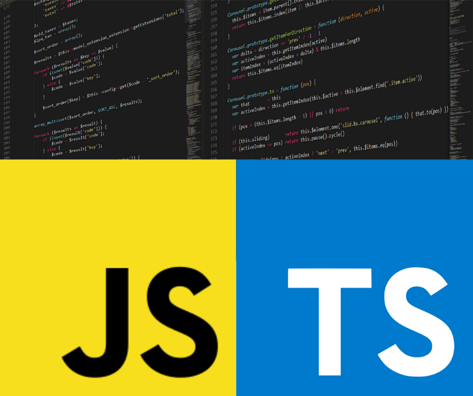
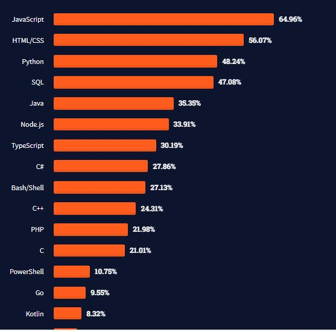

<style>
@import url('https://fonts.googleapis.com/css2?family=Prompt:ital,wght@0,100;0,300;0,400;0,700;1,100;1,300;1,400;1,700&display=swap');

    :root {
    font-family: Prompt;
    --hl-color: #D57E7E;
}
h1 {
  font-family: Prompt
}
</style>

# Blockchain for Industrial Engineers: Decentralized Application Development

## บล็อกเชนสำหรับวิศวกรอุตสาหการ: การพัฒนาแอปพลิเคชันแบบกระจายศูนย์

---



---

# JavaScript

- JavaScript is the Programming Language for the Web
- Can be used on server-side
  - `Node.js`
- [Image Source](https://www.devopsschool.com/blog/top-popular-programming-languages-in-2022-by-stackoverflow-ranking/)



---

# TypeScript

- TypeScript is a syntactic superset of JavaScript which adds static typing.
- It shares the same base syntax as JavaScript, but adds something to it.
- _Much beter than JavaScript, trust me._

---

# What is a variable?

- A variable is a _container_ for a value
- Things we can store.
  - Actual value: `1` / `"Text"` / `true`, ...
  - `Reference` (pointer) to an object

---

# Declaring a variable

```javascript
let myName;
let myAge;
```

- All code instructions should end with a semi-colon.

---

# Initializing a variable

```javascript
let myName;
myName = "Chris";
```

or just

```javascript
let myName = "Chris";
```

---

# Note about `var`

```javascript
var myName;
var myAge;
```

- Old way of delcaring variable
- Error prone
  - [Hoisting](https://developer.mozilla.org/en-US/docs/Web/JavaScript/Reference/Statements/var#var_hoisting)
  - Allowing re-declarations
- _Not recommended_

---

# Re-declaration

- (Use quokka)

```javascript
let x = 5;
let x = 10;
console.log(x); \\SyntaxError: Identifier 'x' has already been declared
```

---

# Updating a variable

```javascript
let myName = "Chris";
myName = "Bob"; //Updating
```

---

# `const`

- Variables defined with const `cannot` be redeclared and updated.

```javascript
const a = 10;
// Cannot change a. This will give error.
// a = 20
```

---

# Good variable naming

Good

```javascript
age;
myAge;
init;
initialColor;
finalOutputValue;
audio1;
audio2;
```

---

# Bad variable naming

```javascript
1;
a;
_12;
myage;
MYAGE;
var Document;
skjfndskjfnbdskjfb;
thisisareallylongstupidvariablenameman;
```

---

# Variable types

- Numbers
- Strings
- Booleans
- Arrays
- Objects

---

# Numbers

```javascript
let myAge = 17;
console.log(typeof myAge); //number
```

---

# Number operations

- `+`, `-`, `*`, `/`
- Modulo `%`
- Exponent `**`

---

# Operator precidence

```javascript
const num1 = 10;
const num2 = 50;
num2 + num1 / 8 + 2; //Get 53.25
(num2 + num1) / (8 + 2); //Get 6
```

---

# Increment and decrement operators

```javascript
let a = 1;
a++;
console.log(a); // 2
++a;
console.log(a); // 3
a += 1;
console.log(a); // 4
```

---

# Strings

- Strings are pieces of text.
- When you give a variable a string value, you need to wrap it in single or double quote marks.

```javascript
let dolphinGoodbye = "So long and thanks for all the fish";
typeof dolphinGoodbye; //string
```

---

# Use quotes in string

```javascript
const bigmouth = "Using ' is okay.  Also is \"...";
console.log(bigmouth);
// Using ' is okay.  Also is "...
```

---

# Concatenating strings

- `+` operator

```javascript
const str1 = "Hello";
const str2 = "World";
console.log(str1 + " " + str2 + " !");
```

- Template literal

```javascript
console.log(`${str1} ${str2} !`);
```

---

# String / Number transformation

- A problem with a number stored as a string type

```javascript
let myNumber = "74";
myNumber += 3; // Get 743
```

- To fix this

```javascript
Number(myNumber) + 3;
```

---

# Multiline strings

- Break characters `\n`

```javascript
const output = "I like the song.\nI gave it a score of 90%.";
console.log(output);

// I like the song.
// I gave it a score of 90%.
```

---

# Multiline strings (cont)

- Template literals respect the line breaks in the source code.

```javascript
const output = `I like the song.
I gave it a score of 90%.`;
console.log(output);

// I like the song.
// I gave it a score of 90%.
```

---

# Strings as objects

- Most things are objects in JavaScript.

```javascript
const string = "This is my string";
```

- The variable becomes a `String` object instance.
  - Contains [properties and methods](https://developer.mozilla.org/en-US/docs/Web/JavaScript/Reference/Global_Objects/String).

---

# String length

```javascript
const browserType = "mozilla";
browserType.length; // 7
```

---

# Accessing string characters

```javascript
browserType[0]; // "m"
browserType[browserType.length - 1]; // "a"
```

- Remember: computers count from 0, not 1!

---

# Testing if a string contains a substring

```javascript
browserType.includes("zilla"); // true
```

---

# Extracting a substring from a string

```javascript
browserType.slice(1, 4); // "ozi"
browserType.slice(2); // "zilla"
browserType.slice(0, -1); // "mozill
```

---

# Changing case

```javascript
const radData = "My NaMe Is MuD";
console.log(radData.toLowerCase()); //my name is mud
console.log(radData.toUpperCase()); //MY NAME IS MUD
```

---

# Updating parts of a string

```javascript
const browserType = "mozilla";
const updated = browserType.replace("moz", "van");

console.log(updated); // "vanilla"
console.log(browserType); // "mozilla"
```

- Note that `replace()` doesn't change the string it was called on.

---

# Booleans

- Booleans are `true`/`false` values.
- These are generally used to test a condition, after which code is run as appropriate.

```javascript
let iAmAlive = true;
let test = 6 < 3;
typeof test; //boolean
```

---

# `null` and `undefine`

- `undefined`
  - Variable has been declared but has not yet been assigned a value.
- `null`
  - Assignment of no value.

---

```js
let testUndefined;
console.log(testUndefined); //shows undefined
console.log(typeof testUndefined); //shows undefined
```

```js
let testNull = null;
console.log(testNull); //shows null
console.log(typeof testNull); //shows object
```

---

# Arrays

- An array is a single `object` that contains multiple values enclosed in square brackets and separated by commas.

```javascript
let myNameArray = ["Chris", "Bob", "Jim"];
let myNumberArray = [10, 15, 40];
```

---

# Finding the length of an array

```javascript
const shopping = ["bread", "milk", "cheese", "hummus", "noodles"];
console.log(shopping.length); // 5
```

---

# Accessing and modifying array items

```javascript
const shopping = ["bread", "milk", "cheese", "hummus", "noodles"];
console.log(shopping[0]);
// returns "bread"
```

```javascript
const shopping = ["bread", "milk", "cheese", "hummus", "noodles"];
shopping[0] = "tahini";
console.log(shopping);
// shopping will now return [ "tahini", "milk", "cheese", "hummus", "noodles" ]
```

---

# Multi-dimensional array

```javascript
const random = ["tree", 795, [0, 1, 2]];
random[2][2];
```

---

# Finding items in an array

```javascript
const birds = ["Parrot", "Falcon", "Owl"];
console.log(birds.indexOf("Owl")); //  2
console.log(birds.indexOf("Rabbit")); // -1
```

---

# Adding items (end)

```javascript
const myArray = ["Manchester", "Liverpool"];
myArray.push("Cardiff");
console.log(myArray); // [ "Manchester", "Liverpool", "Cardiff" ]
myArray.push("Bradford", "Brighton");
console.log(myArray); // [ "Manchester", "Liverpool", "Cardiff", "Bradford", "Brighton" ]
```

---

# Adding items (end)

```javascript
const myArray = ["Manchester", "Liverpool"];
const newLength = myArray.push("Bristol");
console.log(myArray); // [ "Manchester", "Liverpool", "Bristol" ]
console.log(newLength); // 3
```

---

# Adding items (start)

```javascript
const myArray = ["Manchester", "Liverpool"];
myArray.unshift("Edinburgh");
console.log(myArray); // [ "Edinburgh", "Manchester", "Liverpool" ]
```

---

# Removing items

- To remove the last item from the array, use `pop()`.

```javascript
const myArray = ["Manchester", "Liverpool"];
myArray.pop();
console.log(myArray); // [ "Manchester" ]
```

```javascript
const myArray = ["Manchester", "Liverpool"];
const removedItem = myArray.pop();
console.log(removedItem); // "Liverpool"
```

---

# Removing items

- To remove the first item from an array, use `shift()`

```javascript
const myArray = ["Manchester", "Liverpool"];
myArray.shift();
console.log(myArray); // [ "Liverpool" ]
```

---

# Removing items

- Using `splice()`
  - First argument says where to start removing items
  - Second argument says how many items should be removed.

```javascript
const myArray = ["Manchester", "Liverpool", "Edinburgh", "Carlisle"];
const index = myArray.indexOf("Liverpool");
if (index !== -1) {
  myArray.splice(index, 1);
}
console.log(myArray); // [ "Manchester", "Edinburgh", "Carlisle" ]
```

---

# String-array conversion

```javascript
const myData = "Manchester,London,Liverpool,Birmingham,Leeds,Carlisle";
```

- Convert to array

```javascript
const myArray = myData.split(",");
myArray;
```

- Convert to string

```javascript
const myNewString = myArray.join(",");
myNewString;
```

---

# Accessing every item

```javascript
const birds = ["Parrot", "Falcon", "Owl"];

for (const bird of birds) {
  console.log(bird);
}
```

---

# Objects

- An object is a structure of code that models a real-life object.
- For example, an object that represents a box which contains
  - `Width` / `Length` / `Height`
- An object that represents a person which contains
  - `Name` / `Height` / `Weight` / `Language` / `How to say hello`

---

# Declaring an object

- Declare a blank object

```javascript
const person = {};
```

- Initialize an object

```javascript
let dog = { name: "Spot", breed: "Dalmatian" };
```

---

# Retrieve the information

- Retrieve the information stored in the object

```javascript
let dog = { name: "Spot", breed: "Dalmatian" };
console.log(dog.name); // 'Spot'
```

---

# More complex object

```javascript
const person = {
  name: ["Bob", "Smith"],
  age: 32,
  gender: "male",
  interests: ["music", "skiing"],
  greeting: function () {
    alert(`Hi! I'm " ${this.name[0]}.`);
  },
};
```

---

# More complex object

```javascript
person.name;
person.name[0];
person.age;
person.interests[1];
person.greeting();
```

---

# Object member

- The value of an object member can be pretty much anything.
  - String
  - Number
  - Arrays
  - Functions.
- The data are referred to as the object's _properties_.
- The function is referred to as the object's _method_.

---

# Dot notation

```javascript
const person = {
  name: {
    first: "Bob",
    last: "Smith",
  },
  age: 30,
};
```

```javascript
person.name.first;
person.name.last;
```

---

# Bracket notation

```javascript
person["age"];
person["name"]["first"];
```

- Looks very similar to how you access the items in an array/
- It is basically the same thing — instead of using an index number to select an item, you are using the name associated with each member's value.

---

# Set object members

```javascript
person.age = 45;
person["name"]["last"] = "Cratchit";
person["eyes"] = "hazel"; // New properties
person.farewell = function () {
  alert("Bye everybody!");
};
```

```javascript
let myDataName = "height";
let myDataValue = "1.75m";
person[myDataName] = myDataValue;
```

---

# What is "this"?

```javascript
greeting: function() {
  alert('Hi! I\'m ' + this.name.first + '.');
}
```

- The this keyword refers to the current object the code is being written inside — so in this case this is equivalent to person.

---

# What is "this"?

```javascript
const person1 = {
  name: "Chris",
  greeting: function () {
    alert("Hi! I'm " + this.name + ".");
  },
};

const person2 = {
  name: "Deepti",
  greeting: function () {
    alert("Hi! I'm " + this.name + ".");
  },
};
```

---

# What is "this"?

- Using `this` isn't hugely useful when you are writing out object literals by hand.
- But it really comes into its own when you are dynamically generating objects (for example using constructors).
