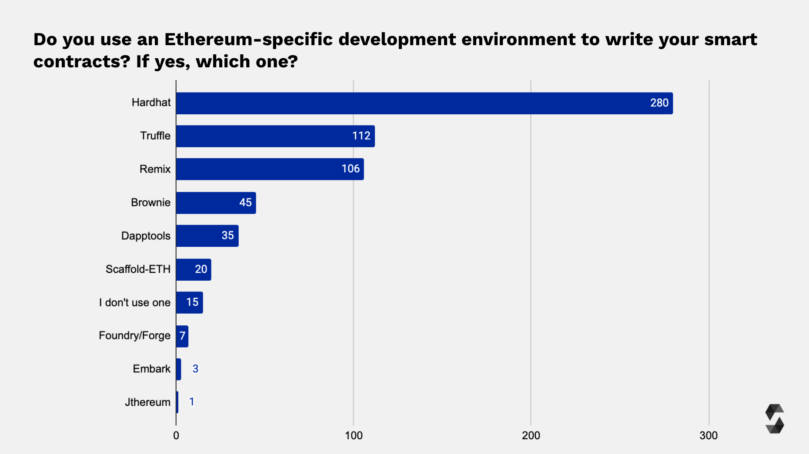

<style>
@import url('https://fonts.googleapis.com/css2?family=Prompt:ital,wght@0,100;0,300;0,400;0,700;1,100;1,300;1,400;1,700&display=swap');

    :root {
    font-family: Prompt;
    --hl-color: #D57E7E;
}
h1 {
  font-family: Prompt
}
</style>

# Blockchain for Industrial Engineers: Decentralized Application Development

## บล็อกเชนสำหรับวิศวกรอุตสาหการ: การพัฒนาแอปพลิเคชันแบบกระจายศูนย์

---

# Development environment for Ethereum software

---

# Why not Remix?

- Remix is great for quick development and testing.
- However, Remix lacks advance functionality and customization.
  - Testing
  - Automatic deployment
  - Debugging

---

# Environment


[Source](https://blog.soliditylang.org/2022/02/07/solidity-developer-survey-2021-results/)

---

# Getting started with Hardhat

---

## VSCode

- Install `Solidify` (by Nomic Foundation) extension

---

## Command line

- `npm init -y`
- `npm install --save-dev ts-node typescript dotenv`
- `npm install --save-dev chai @types/node @types/mocha @types/chai`
- `npm install --save-dev hardhat @nomicfoundation/hardhat-toolbox`
- `npx hardhat`
  - Choose `TypeScript`

---

# Contract

- Create `./contracts/MySecret.sol`

```js
// SPDX-License-Identifier: GPL-3.0
pragma solidity >=0.7.0 <0.9.0;
contract MySecret {
    string public secret;
    constructor(string memory _secret) {
        secret = _secret;
    }
    function changeSecret(string memory _secret) public {
        secret = _secret;
    }
}
```

---

# Compiling

- `npx hardhat compile`
- The compiled files will be in `artifacts` folder.

---

# Testing

`./test/MySecret.ts`

```js
import { expect } from "chai";
import { ethers } from "hardhat";

describe("Secret Message", () => {
  it("checks initial message", async () => {
    const MySecret = await ethers.getContractFactory("MySecret");
    const mySecret = await MySecret.deploy("My Super Secret!");
    expect(await mySecret.secret()).to.equal("My Super Secret!");
  });
});
```

---

# Testing

- `npx hardhat test`

---

# Deployment

`./scripts/deploy-my-secret.ts`

```js
import { ethers } from "hardhat";

async function main() {
  const Secret = await ethers.getContractFactory("MySecret");
  const secret = await Secret.deploy("My Super Secret!");
}

main()
  .then(() => console.log("Deploy Successfully"))
  .catch((error) => {
    console.error(error);
    process.exitCode = 1;
  });
```

---

# One time deployment

- `npx hardhat run scripts/deploy-my-secret.ts`
  - Hardhat will create a local network, deploy contract and exit.

---

# Deploying to local network

- `npx hardhat node`
- `npx hardhat run --network localhost scripts/deploy-my-secret.ts`
  - Use separate terminal.

---

# Connect to local network with MetaMask

- `Setting` -> `Network` -> `Add Network` -> `Add a network manually`

  - Name: `HardHat`
  - RPC URL: `http://localhost:8545`
  - Chain ID: `31337`

- Import account
  - `0xac0974bec39a17e36ba4a6b4d238ff944bacb478cbed5efcae784d7bf4f2ff80`

---

# Deploying to live network

### Alchemy

- Visit https://www.alchemy.com/
- Create `APP`
- Obtain `API Key`

### MetaMask

- Get your private key.

---

# `env` file

`./.env`

```
ALCHEMY_API_KEY=<<PASTE API KEY HERE>>
GOERLI_PRIVATE_KEY=<<PASTE PRIVATE KEY HERE>>
```

---

`./hardhat.config.ts`

```js
import { config as dotEnvConfig } from "dotenv";
dotEnvConfig();
import { HardhatUserConfig } from "hardhat/config";
import "@nomicfoundation/hardhat-toolbox";

const ALCHEMY_API_KEY = process.env.ALCHEMY_API_KEY || "";
const GOERLI_PRIVATE_KEY = process.env.GOERLI_PRIVATE_KEY || "";

const config: HardhatUserConfig = {
  solidity: "0.8.17",
  networks: {
    goerli: {
      url: `https://eth-goerli.alchemyapi.io/v2/${ALCHEMY_API_KEY}`,
      accounts: [GOERLI_PRIVATE_KEY],
    },
  },
};

export default config;
```

---

# Live deployment

- `npx hardhat run --network goerli scripts/deploy-my-secret.ts`
- Check _Explorer_ page in Alchemy.
