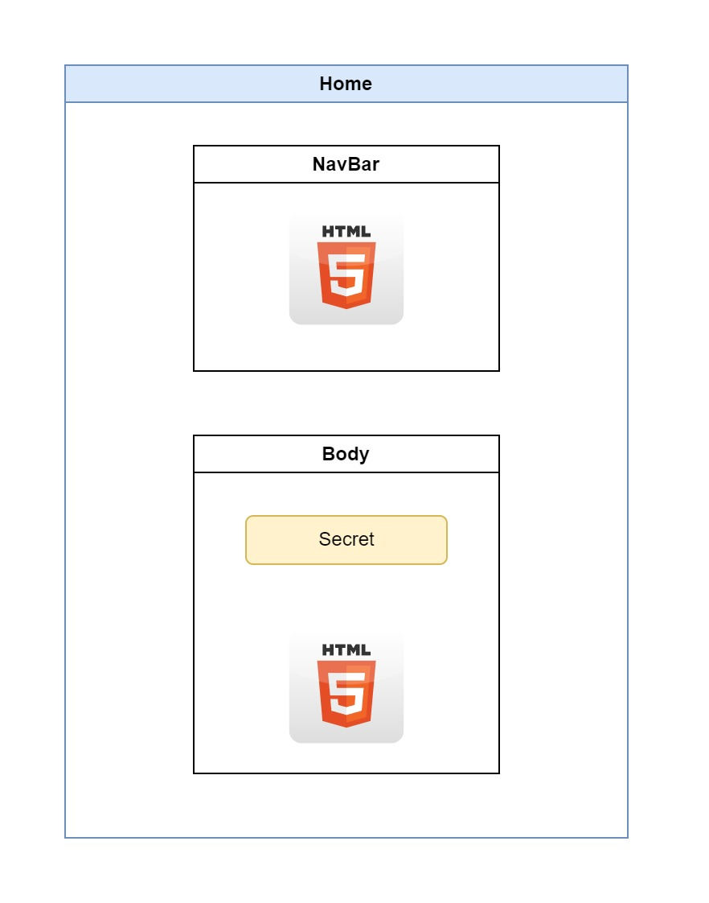
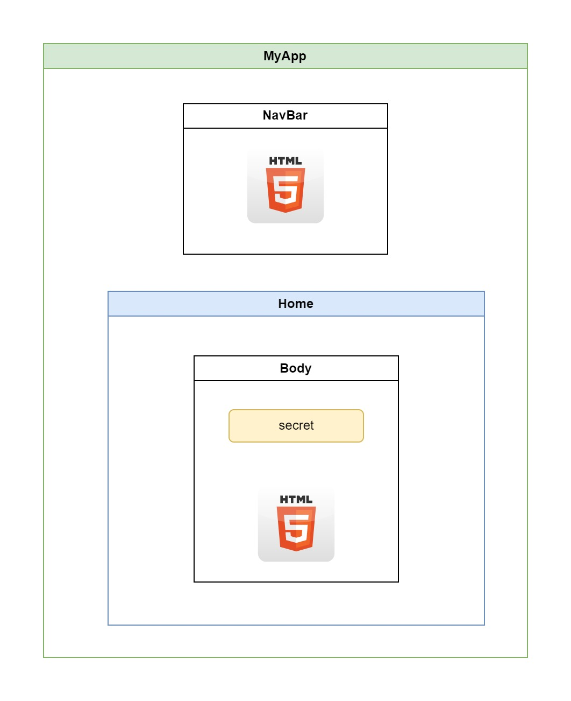

<style>
@import url('https://fonts.googleapis.com/css2?family=Prompt:ital,wght@0,100;0,300;0,400;0,700;1,100;1,300;1,400;1,700&display=swap');

    :root {
    font-family: Prompt;
    --hl-color: #D57E7E;
}
h1 {
  font-family: Prompt
}
</style>

# Blockchain for Industrial Engineers: Decentralized Application Development

## บล็อกเชนสำหรับวิศวกรอุตสาหการ: การพัฒนาแอปพลิเคชันแบบกระจายศูนย์

---

# Decentralized application (DApp)

---

# Part 1: Application structure

---

# Template

- Fork the following repository
  - https://github.com/nnnpooh/blockchain-class-dapp
- Clone your new forked repository to local machine
  - `git clone ......`
- Open the newly cloned folder in `VSCode`
- Install library
  - `npm install`
- Run
  - `npm run dev`

---

# Structure

- `Home` component
  - `NavBar` component
  - `Body` component
- Reactive variable
  - `secret`
    

---

# Part 2: Connecting to MetaMask

---

# Library

- Install `ethers` library
  - `npm install ethers@5.7.2`

---

# `_app` file

- Manage layout
  

---

# Centralized store

---

# Stores

- `useWorkingStore()`
  - `secret`
- `useMetaMaskStore()`
  - `account`
  - `balance`
  - `chainId`
  - `isEthereumAvailable`
  - `provider`
- [`./src/utils/stores.ts`](https://gist.github.com/nnnpooh/8a8ed7ebe3659c73d159e1e495d7af86#file-stores-ts)

---

# Startup Logics

- Open MetaMask
- Setup listener
  - Change account
  - Change network
- [`./src/utils/useEthereum.ts`](https://gist.github.com/nnnpooh/8a8ed7ebe3659c73d159e1e495d7af86#file-useethereum-ts)
  - Using `useEffect` function
- Insert `useEthereum()` into `_app.tsx`

---

# Fix `TypeScript` Error

- `types/index.d.ts`

```js
import { ExternalProvider } from "@ethersproject/providers";
import { MetaMaskInpageProvider } from "@metamask/providers";

declare global {
  interface Window {
    ethereum?: MetaMaskInpageProvider;
  }
}

export {};
```

---

- `tsconfig.json`

```json
...
"typeRoots": ["./node_modules/@types", "./src/types"],
...
```

---

# React to change in state

- When you change account and network in Metamask, the application should react to it.
  - `useEffect` with dependency.
- [./src/utils/useMetaMask.ts](https://gist.github.com/nnnpooh/8a8ed7ebe3659c73d159e1e495d7af86#file-usemetamask-ts)
- Insert `useEthereum()` into `_app.tsx`
- Insert `useMetaMask()` into into `_app.tsx`

---

# Update `AccountButton`

- [AccountButton](https://gist.github.com/nnnpooh/8a8ed7ebe3659c73d159e1e495d7af86#file-navbar-tsx)

---

# Part 3: Incorporating smart contract

---

# HardHat

- Create a contact `Secret.sol` (code below)
- Compile the contract
  - `npx hardhat compile`
  - Obtain `Secret.json`
- Create a deploy script `deploy-secret.ts` (code below)
- Deploy the contract.
  - `npx hardhat run --network goerli ./scripts/deploy-secret.ts`
  - _(You need Alchemy key.)_
- Obtain contract address

---

`./contracts/Secret.sol`

```js
// SPDX-License-Identifier: GPL-3.0
pragma solidity >=0.7.0 <0.9.0;
contract Secret {
    string public secret;
    address public owner;
    constructor(string memory _secret) {
        owner = msg.sender;
        secret = _secret;
    }
    modifier onlyOwner() {
        require(msg.sender == owner, "Only owner can change the message.");
        _;
    }
    function changeSecret(string memory _secret) public onlyOwner {
        secret = _secret;
    }
}
```

---

`./scripts/deploy-secret.ts`

```js
import { ethers } from "hardhat";

async function main() {
  const Secret = await ethers.getContractFactory("Secret");
  const secret = await Secret.deploy("Really Secret Message");
}
main().catch((error) => {
  console.error(error);
  process.exitCode = 1;
});
```

---

# Insert smart contract to DApp

- Copy `Secret.json` from HardHat to `./src/abi`
- Create `./src/abi/secret.ts`

```js
import Secret from "./Secret.json";
export const SecretContract = Secret;
export const contractAddress = process.env.NEXT_PUBLIC_CONTRACT_ADDRESS || "";
```

- Create `./.env` ("Dot" ENV file)
  - Insert your contract address (from Etherscan)

```
NEXT_PUBLIC_CONTRACT_ADDRESS=........
```

---

# Create logics to fetch and change `secret`

- Create `./src/components/home/useContract.ts`
  - Fetch `secret` message when there is a change in accout and network.
    - When `secret` cannot be fetched, handle the error.
  - Export `writeSecret` function to change `secret` when the button is pressed.
  - Keep track of the loading state through `isLoading`.
  - Keep track of error state through `isError`.
  - [Code](https://gist.github.com/nnnpooh/15a43822f55cc7fcc6f90e3973320a2c#file-usecontract-ts)

---

# Update UI

- Modify `./src/components/home/Body.tsx`
  - Display real `secret`
  - Button will trigger transaction from MetaMask.
  - Show loading state (loading spinner).
  - Show errors (icon) when `secret` cannot be fetched.
  - Disable input when errors occur.
  - [Code](https://gist.github.com/nnnpooh/15a43822f55cc7fcc6f90e3973320a2c#file-body-tsx)
- Personalize your application.

---

# Building project

- Ignore code checking rules.
  - Change `ignoreDuringBuilds` to `true`

`./next.config.mjs`

```js
  eslint: {
    ignoreDuringBuilds: true, // Change from false to true
  },
```

- `npm run build`

---

# Upload your change to GitHub

- `git add .`
- `git commit -m "Working Version"`
- `git push`

---

# Deploy your DApp to cloud provider

- https://vercel.com/
- Sign up with your GitHub account
- In the `Let's build something new.` page
  - Under `Import Git Repository`
    - Select `+ GitHub Account`
  - Your should see your repository name appearing.
  - Click `Import`

---

# Deploy your DApp to cloud provider

- In the `You're almost done.` page
  - Under `Environment Variables`
    - `Name`: `NEXT_PUBLIC_CONTRACT_ADDRESS`
    - `Value`: _[Contract Address]_
  - Save the change.
  - Click `Deploy`
- Once finished, you should see the link to your DApp in the dashboard page.
  - You can also change the domain by going to `Settings`-> `Domains`

---

# Testing your app

- Make sure you have the environment variable in `Settings` -> `Environment Variables`
- If you make changes to the environment variables
  - Go to the `Deployments` tab
  - Click at dropdown menu of the last deployment.
  - Click `Redeploy`

---

# Yay ....
